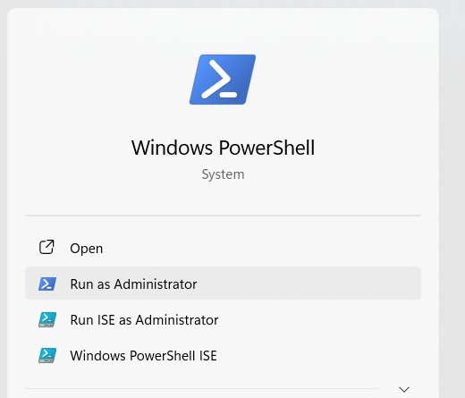
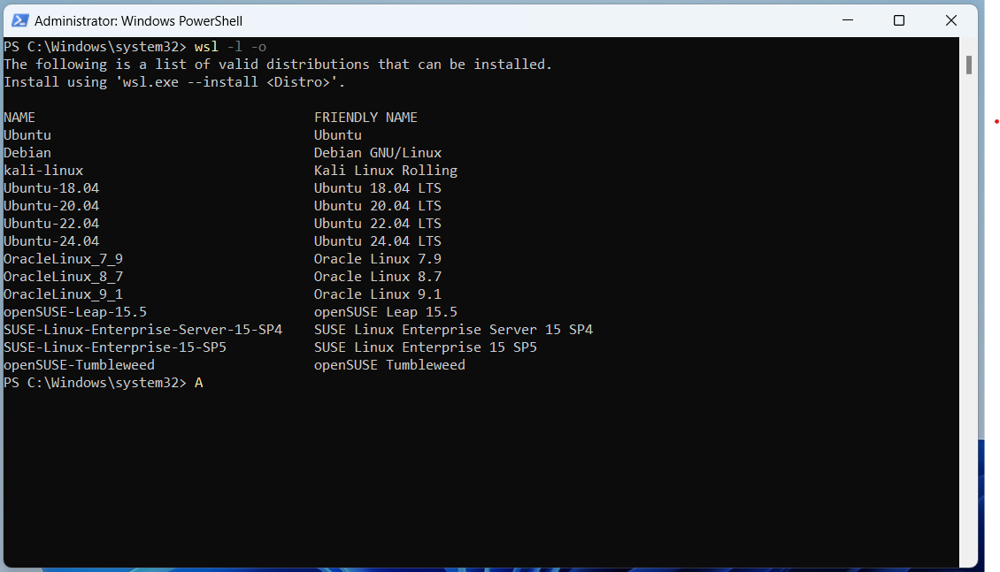
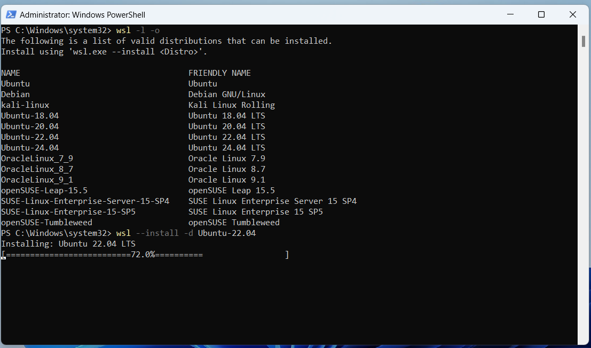
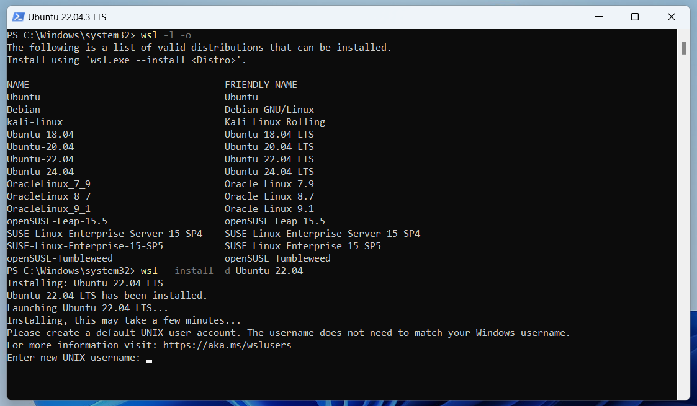
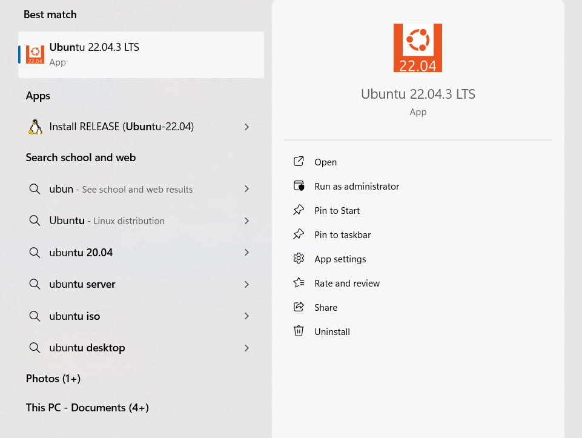
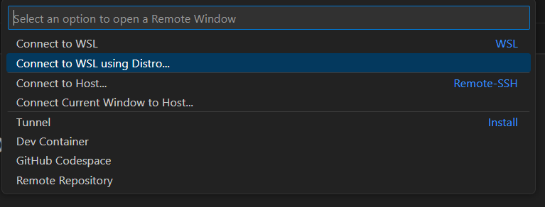

# SET UP UBUNTU ON WSL2

## What is WSL?

You can read about [Windows Subsystem for Linux (WSL)](https://learn.microsoft.com/en-us/windows/wsl/) in Microsoft's documentation.

## Install Ubuntu on WSL2

Follow the [guide](https://canonical-ubuntu-wsl.readthedocs-hosted.com/en/latest/guides/install-ubuntu-wsl2/) provided by [Canonical](https://canonical.com/) - the organization behind Ubuntu's development and distribution.

- Step 1: Open powershell



- Step 2: List all available distributions

```console
wsl --list --online
```



- Step 3: Choose one distribution and install. I choose Ubuntu-22.04

```console
wsl --install -d < name >
wsl --install -d Ubuntu-22.04
```



- Step 4: Create a user and welcome to Ubuntu on WSL2



**Note: On Linux, passwords are not displayed as you type.**

- Step 5: Install the latest updates

```console
sudo apt update
sudo apt full-upgrade -y
```

There you go! Now you can use Ubuntu on WSL2.



## Use with Visual Studio Code (VS Code)

Follow this [guide](https://code.visualstudio.com/docs/remote/wsl) from VS Code documentation, you can use VS Code with WSL.

- Step 1: Install WSL extension


- Step 2: Connect

Click this symbol in the bottom-right corner of VS Code window


Then choose the distro you want to connect


Wait a few minutes if you are connecting for the first time.


There you go!

## Install necessary packages

### For C/C++ development

```console
sudo apt install build-essential
```

You can verify the installation using "Hello world" program saved in ```test.cpp```

```cpp
#include <iostream>

int main() {
    std::cout << "Hello world\n";
    return 0;
}
```

```console
g++ test.cpp -o test
./test
```

### For Python development

Ubuntu typically comes pre-installed with Python 3. So you just need ```pip```.

```console
sudo apt install python3-pip
```

### Docker

Follow CAREFULLY the [guide](https://docs.docker.com/engine/install/ubuntu/) from Docker official website.

- Step 1: Uninstall old versions:

These packages must be uninstalled: ```docker.io```, ```docker-compose```, ```docker-compose-v2```, ```docker-doc```, ```podman-docker```, ```containerd```, ```runc```.

```console
sudo apt remove docker.io docker-compose docker-compose-v2 docker-doc podman-docker containerd runc
```

After uninstall, clean up any residual dependencies:

```console
sudo apt autoremove
```

- Step 2: Set up the ```apt``` repository

```console
# Add Docker's official GPG key:
sudo apt-get update
sudo apt-get install ca-certificates curl
sudo install -m 0755 -d /etc/apt/keyrings
sudo curl -fsSL https://download.docker.com/linux/ubuntu/gpg -o /etc/apt/keyrings/docker.asc
sudo chmod a+r /etc/apt/keyrings/docker.asc

# Add the repository to Apt sources:
echo \
  "deb [arch=$(dpkg --print-architecture) signed-by=/etc/apt/keyrings/docker.asc] https://download.docker.com/linux/ubuntu \
  $(. /etc/os-release && echo "$VERSION_CODENAME") stable" | \
  sudo tee /etc/apt/sources.list.d/docker.list > /dev/null
sudo apt-get update
```

- Step 3: Install the Docker packages

```console
sudo apt-get install docker-ce docker-ce-cli containerd.io docker-buildx-plugin docker-compose-plugin
```

- Step 4: Verify

```console
sudo docker run hello-world
```

- Step 5: Running Docker without sudo

Create ```docker``` group

```console
sudo groupadd docker
```

Add your user to that group

```console
sudo usermod -aG docker $USER
```

Exit WSL, and get in back. Now you can run without sudo

```console
docker run hello-world
```

## Git for GitHub

### Via http

_(Generated by Gemini)_

#### Step 1: Generate Personal Access Token (PAT):

- Go to your GitHub account settings: https://github.com/settings/profile
- Navigate to the "Developer settings" section.
- Click on "Personal access tokens" and then "Generate new token".
- Choose a descriptive name for your token (e.g., "pull_push_private_repo").
- Under "Select scopes", select the "repo" checkbox. This grants access to pull and push code to your repositories.
- **Important: Avoid giving the token "admin" access. Grant only the minimum permissions required.**
- Click "Generate token" and copy the generated token securely. You won't be able to see it again later.

#### Step 2: Configure Git Credential Helper:

- Run the following command to configure the "git-credential-store" helper:
```console
git config --global credential.helper store
```
This command tells Git to use the "store" helper for credential management.

#### Step 3: Add Username and PAT to Credential Helper:

- Run the following command in your terminal, replacing <username> with your GitHub username and pasting your PAT when prompted:
```console
git credential-store store https://<username>:<your_PAT>@github.com
```
You'll be prompted to enter your PAT. Paste it securely and press Enter.

Git will now use the stored credentials to authenticate and clone your private repository.

***Remember:***

- The Personal Access Token (PAT) you generated should be kept secret. Don't share it with anyone or include it in your code or scripts.
- Using the credential helper is a more secure way to store your credentials compared to embedding them directly in the Git URL.

This guide should help you set up HTTPS authentication with a credential helper on Ubuntu to access and manage your private GitHub repository securely.

### Via ssh

This guide should help you to manage two github accounts at the same time.

#### Generate SSH Keys for Each Account
You'll need separate SSH keys for each GitHub account.

Open a terminal and generate the first SSH key:

```console
ssh-keygen -t ed25519 -C "account1@example.com"
```
Save the key as `~/.ssh/id_ed25519_account1` when prompted.
Enter a passphrase if you want extra security.

Generate the second SSH key:

```console
ssh-keygen -t ed25519 -C "account2@example.com"
```
Save the key as `~/.ssh/id_ed25519_account2` when prompted.
Enter a passphrase if you want extra security.

Add your SSH keys to the SSH agent:

```console
eval "$(ssh-agent -s)"
ssh-add ~/.ssh/id_ed25519_account1
ssh-add ~/.ssh/id_ed25519_account2
```

#### Add SSH Keys to GitHub Accounts
Copy the SSH key to your clipboard:

```console
cat ~/.ssh/id_ed25519_account1.pub
```

Copy the output and add it to GitHub:

Go to GitHub (logged in as account1).
Navigate to `Settings > SSH and GPG keys > New SSH key`.
Paste the key and give it a descriptive title.

Do the same for the second SSH key:

```console
cat ~/.ssh/id_ed25519_account2.pub
```

#### Configure SSH to Use the Correct Key for Each Account
Edit the SSH config file:

```console
nano ~/.ssh/config
```
Add the following configuration:

```
# Default GitHub account
Host github.com
  User git
  Hostname github.com
  IdentityFile ~/.ssh/id_ed25519_account1

# Second GitHub account
Host github-account2
  User git
  Hostname github.com
  IdentityFile ~/.ssh/id_ed25519_account2
```
This configuration maps github-account2 to the second SSH key.

#### Configure Git User for Each Repository
You need to set up Git to use the correct email and username for each repository.

Navigate to your project directory or initialize a new repository:

```console
cd /path/to/your/repo
```
Set up the repository-specific user:

For account1:

```console
git config user.name "account1"
git config user.email "account1@example.com"
```
For account2:

```console
git config user.name "account2"
git config user.email "account2@example.com"
```

#### Clone Repositories Using the Correct SSH Host
When cloning repositories, use the configured SSH host to ensure the correct key is used.

For the default GitHub account:

```console
git clone git@github.com:username/repository.git
```
For the second GitHub account:

```console
git clone git@github-account2:username/repository.git
```
6. Verify Your Setup
To verify that the correct SSH key is being used, you can test the connection:

```console
ssh -T git@github.com
```
And for the second account:

```console
ssh -T git@github-account2
```

You should see a success message indicating that you’ve successfully authenticated.
