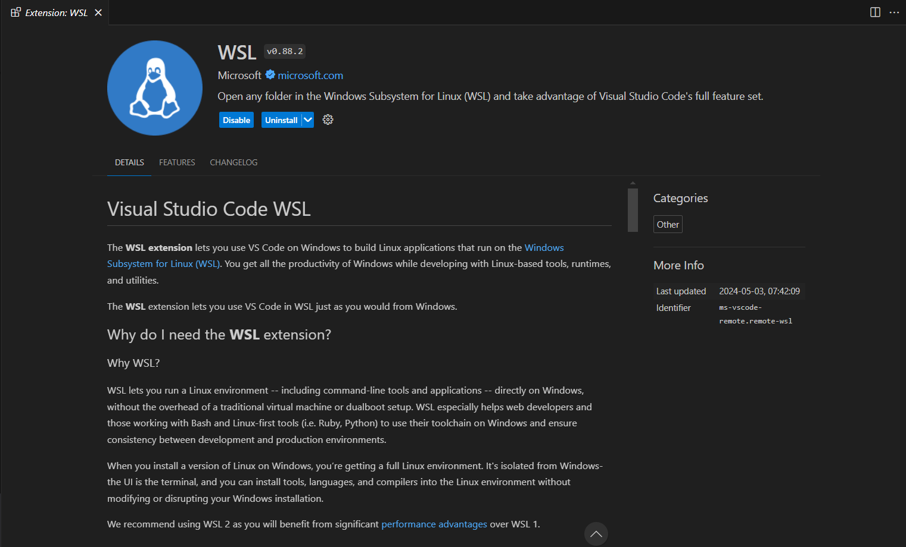

# SET UP UBUNTU ON WSL2

## What is WSL?

You can read about [Windows Subsystem for Linux (WSL)](https://learn.microsoft.com/en-us/windows/wsl/) in Microsoft's documentation.

## Install Ubuntu on WSL2

Follow the [guide](https://canonical-ubuntu-wsl.readthedocs-hosted.com/en/latest/guides/install-ubuntu-wsl2/) provided by [Canonical](https://canonical.com/) - the organization behind Ubuntu's development and distribution.

- Step 1: Open powershell


- Step 2: List all available distributions

```sh
wsl --list --online
```


- Step 3: Choose one distribution and install. I choose Ubuntu-22.04

```sh
wsl --install -d < name >
wsl --install -d Ubuntu-22.04
```


- Step 4: Create a user and welcome to Ubuntu on WSL2


**Note: On Linux, passwords are not displayed as you type.**

- Step 5: Install the latest updates

```sh
sudo apt update
sudo apt full-upgrade -y
```

There you go! Now you can use Ubuntu on WSL2.


## Use with Visual Studio Code (VS Code)

Follow this [guide](https://code.visualstudio.com/docs/remote/wsl) from VS Code documentation, you can use VS Code with WSL.

- Step 1: Install WSL extension



- Step 2: Connect

Click this symbol in the bottom-right corner of VS Code window


Then choose the distro you want to connect


Wait a few minutes if you are connecting for the first time.


There you go!

## Install necessary packages

### For C/C++ development

```sh
sudo apt install build-essential
```

You can verify the installation using "Hello world" program saved in ```test.cpp```

```cpp
#include <iostream>

int main() {
    std::cout << "Hello world\n";
    return 0;
}
```

```sh
g++ test.cpp -o test
./test
```

### For Python development

Ubuntu typically comes pre-installed with Python 3. So you just need ```pip```.

```sh
sudo apt install python3-pip
```

### Docker

Follow CAREFULLY the [guide](https://docs.docker.com/engine/install/ubuntu/) from Docker official website.

- Step 1: Uninstall old versions:

These packages must be uninstalled: ```docker.io```, ```docker-compose```, ```docker-compose-v2```, ```docker-doc```, ```podman-docker```, ```containerd```, ```runc```.

```sh
sudo apt remove docker.io docker-compose docker-compose-v2 docker-doc podman-docker containerd runc
```

After uninstall, clean up any residual dependencies:

```sh
sudo apt autoremove
```

- Step 2: Set up the ```apt``` repository

```sh
# Add Docker's official GPG key:
sudo apt-get update
sudo apt-get install ca-certificates curl
sudo install -m 0755 -d /etc/apt/keyrings
sudo curl -fsSL https://download.docker.com/linux/ubuntu/gpg -o /etc/apt/keyrings/docker.asc
sudo chmod a+r /etc/apt/keyrings/docker.asc

# Add the repository to Apt sources:
echo \
  "deb [arch=$(dpkg --print-architecture) signed-by=/etc/apt/keyrings/docker.asc] https://download.docker.com/linux/ubuntu \
  $(. /etc/os-release && echo "$VERSION_CODENAME") stable" | \
  sudo tee /etc/apt/sources.list.d/docker.list > /dev/null
sudo apt-get update
```

- Step 3: Install the Docker packages

```sh
sudo apt-get install docker-ce docker-ce-cli containerd.io docker-buildx-plugin docker-compose-plugin
```

- Step 4: Verify

```sh
sudo docker run hello-world
```

- Step 5: Running Docker without sudo

Create ```docker``` group

```sh
sudo groupadd docker
```

Add your user to that group

```sh
sudo usermod -aG docker $USER
```

Exit WSL, and get in back. Now you can run without sudo

```sh
docker run hello-world
```